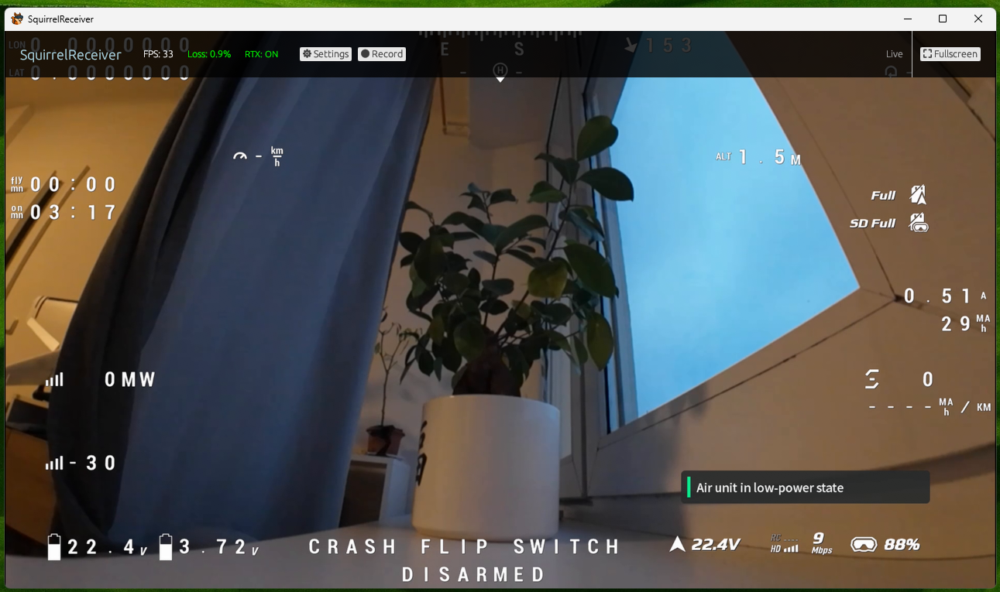

# SquirrelReceiver

SquirrelReceiver is a Windows app for receiving live video from **DJI Goggles 3** on a PC.

It can receive the goggles' built-in Wi-Fi live view. SquirrelReceiver Pro also supports a wired USB mode with lower latency, fewer artifacts, and charging for the goggles while you fly or test.

## Manuals

- [Installing SquirrelReceiver Lite](manuals/installing-squirrelreceiver-lite.md)
- [Installing SquirrelReceiver Pro (Pro)](manuals/installing-squirrelreceiver-pro.md)
- [Wi-Fi Liveview Setup](manuals/wifi-liveview-setup.md)
- [USB Wired Setup (Pro)](manuals/usb-wired-setup-pro.md)
- [First-Time USB Adapter Setup (Pro)](manuals/usb-wired-first-time-adapter-setup-pro.md)
- [Using Live View](manuals/using-live-view.md)
- [Recording Video](manuals/recording-video.md)
- [Lens Correction and LUTs (Pro)](manuals/lens-correction-and-luts-pro.md)
- [Detached Video Window (Pro)](manuals/detached-video-window-pro.md)
- [Custom Waiting Screen Logo (Pro)](manuals/custom-waiting-logo-pro.md)
- [Troubleshooting](manuals/troubleshooting.md)

## Compatibility

- **Goggles:** DJI Goggles 3
- **OS:** Windows 10 or Windows 11, 64-bit
- **Wi-Fi mode:** Lite and Pro
- **Wired USB mode:** Pro only
- **SquirrelCast:** Needed to configure goggles Wi-Fi and to unlock Lite

SquirrelReceiver is not an RTSP or WebRTC receiver. It receives the direct live view stream from DJI Goggles 3.

## Quick Start

### If you use Lite

1. Install SquirrelReceiver Lite.
2. Unlock it through the SquirrelCast Android app.
3. Configure the goggles' Wi-Fi in SquirrelCast.
4. Enable **Liveview sharing** in the goggles.
5. Connect the Windows PC to the goggles' Wi-Fi network.

Read: [Installing SquirrelReceiver Lite](manuals/installing-squirrelreceiver-lite.md) and [Wi-Fi Liveview Setup](manuals/wifi-liveview-setup.md)

### If you use Pro

1. Install [SquirrelReceiver Pro from the Microsoft Store](https://apps.microsoft.com/detail/9p95mhs1678g).
2. Enable **Liveview sharing** in the goggles.
3. Use [USB Wired Setup (Pro)](manuals/usb-wired-setup-pro.md) for the best video path, or [Wi-Fi Liveview Setup](manuals/wifi-liveview-setup.md) for wireless use.

> **Important:** Liveview sharing must be enabled in the goggles for both Wi-Fi and wired mode. This is easy to miss.

## Lite and Pro

| Feature | SquirrelReceiver Lite | SquirrelReceiver Pro |
| --- | --- | --- |
| Wi-Fi live view from DJI Goggles 3 | Yes | Yes |
| Wired USB live view | No | Yes |
| Charges the goggles while receiving video | No | Yes, in wired mode |
| Expected wired latency | Not available | Usually around 100-150 ms, best cases around 75 ms |
| Recording | Yes | Yes |
| Lens correction and LUTs | No | Yes |
| Detached video window | No | Yes |
| Custom waiting screen logo | No | Yes |
| Unlock path | SquirrelCast Android app | Microsoft Store |
| Cost | Free receiver download if you already own SquirrelCast | USD $19.99 |

SquirrelReceiver Lite is meant for the Wi-Fi workflow. Unlocking it uses the SquirrelCast Android app, which costs around USD $7.

SquirrelReceiver Pro is the recommended version if you want the best live view path. The wired mode avoids most Wi-Fi packet loss problems and keeps the goggles charging while connected.

Get Pro here: [SquirrelReceiver Pro on Microsoft Store](https://apps.microsoft.com/detail/9p95mhs1678g)

## Support

For questions, feedback, or compatibility reports, join the Discord:

## Credits

Thanks to Joonas for the help when developing this, and thanks to everyone who tested early builds and reported what worked and what did not.

## Support the Project

If you find this project useful, consider donating to support development.

