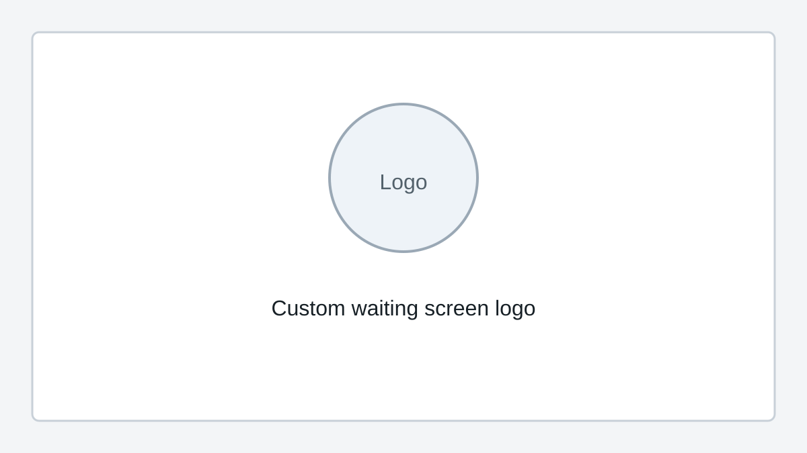

# Custom Waiting Screen Logo (Pro)

Custom waiting screen logo support is a SquirrelReceiver Pro feature.

It changes the logo shown while SquirrelReceiver is waiting for video. This is useful for events, club demos, livestream setups, and ground station screens where the receiver may sit on the waiting screen before the goggles start sending video.

Open SquirrelReceiver Pro settings and choose the waiting screen logo you want to use. The selected logo is shown only on the receiver waiting screen; it does not change the incoming DJI video.
