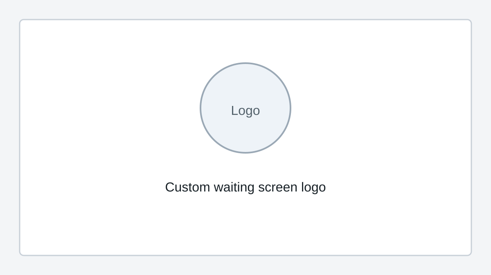

# Custom Waiting Screen Logo (Pro)

Custom waiting screen logo support is a SquirrelReceiver Pro feature.

It lets you change the logo shown while the receiver is waiting for video.

<!-- TODO: Add final screenshots and exact supported image requirements. -->

## What it is for

This is mostly useful for:

- Events
- Club demos
- Livestream setups
- Ground station screens that may sit on the waiting screen for a while

## What still needs to be documented

Before release, this page needs the exact supported image format, recommended size, transparency behavior, and where the selected logo is stored.

Lite should not include this feature.
