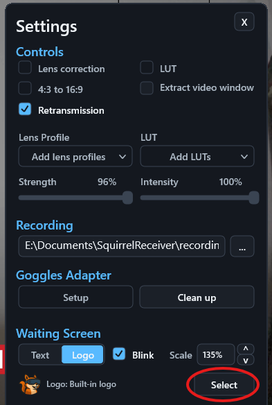
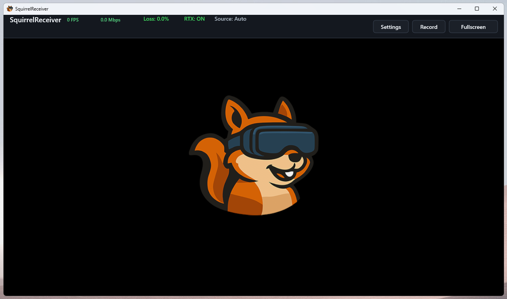

# Custom Waiting Screen Logo (Pro)

Custom waiting screen logo support is a SquirrelReceiver Pro feature.

It changes the logo shown while SquirrelReceiver is waiting for video. This is useful for events, club demos, livestream setups, and ground station screens where the receiver may sit on the waiting screen before the goggles start sending video.

Open SquirrelReceiver Pro settings and find the waiting screen options:

1. Choose **Text** to show a text message, or **Logo** to show an image.
2. With **Logo** selected, use **Select** to choose the image file.
3. Enable the blink option if you want the waiting content to blink.
4. Adjust the scaling control to set the displayed logo size.

The selected text or logo is shown only on the receiver waiting screen; it does not change the incoming DJI video.
