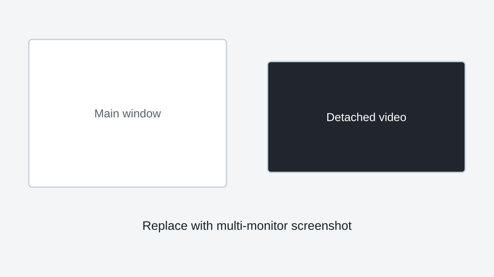

# Detached Video Window (Pro)

The detached video window is a SquirrelReceiver Pro feature.

It lets you move the video to another window or monitor while keeping the main receiver controls separate.

<!-- TODO: Replace placeholder with multi-monitor or detached-window screenshot. -->

## When to use it

Detached video is useful when:

- A second monitor is used for viewers
- The PC is connected to a projector or HDMI capture device
- You want controls on one screen and clean video on another
- You want the detached video fullscreen without hiding the main controls

## Fullscreen behavior

The detached window can be fullscreen on the selected monitor.

SquirrelReceiver remembers the preferred fullscreen state and monitor when possible. If Windows monitor layout changes, you may need to choose the window position again.

## Lite

Lite should not include this feature. Lite is intended to stay focused on the simple Wi-Fi receiver workflow.
