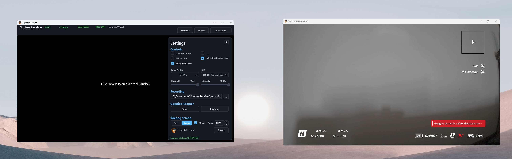
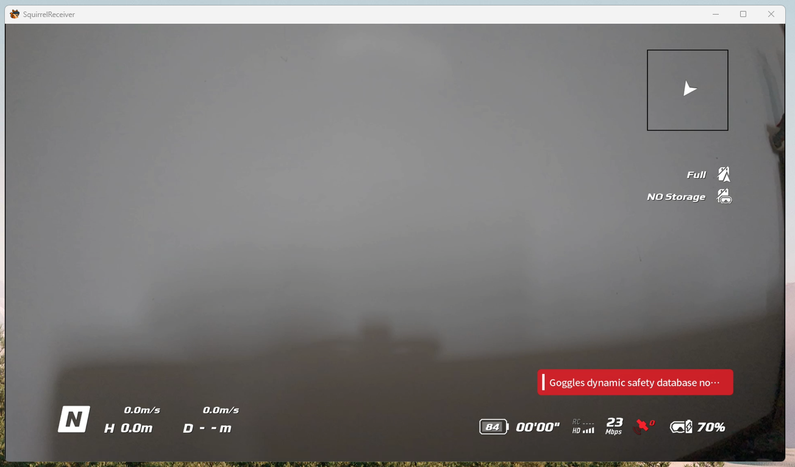

# Detached Video Window (Pro)

The detached video window is a SquirrelReceiver Pro feature.

It opens the live video in a separate window while the main SquirrelReceiver window keeps the controls and settings.

This is useful on a dedicated streamer rig where the video-only window goes to a separate HDMI output, monitor, capture card, or projector. It is also useful when you want OBS to capture only the live video while SquirrelReceiver settings stay on another screen.

OBS can capture the main SquirrelReceiver window, but capturing the detached/external window is usually easier because that window contains no receiver UI.

The clean external window can be placed on another display while the controls remain on the main screen. You can then change receiver settings, lens correction, LUTs, or recording options without showing those controls on the second display, HDMI output, or OBS capture.

## Fullscreen on another display

Move the detached video window to the target display and use fullscreen there.

If Windows is sending that display to a capture card, projector, or streaming device, set the output format in Windows first:

1. Open **Windows Settings**.
2. Go to **System > Display**.
3. Select the display used for the detached video output.
4. Set **Display resolution** to the desired output resolution.
5. Open **Advanced display**.
6. Set the desired refresh rate.

For streaming or capture, common choices are 1920x1080 at 60 Hz or the native mode expected by the HDMI device.

SquirrelReceiver remembers the preferred fullscreen state and monitor when possible. If Windows monitor layout changes, move the detached window to the right display again.
