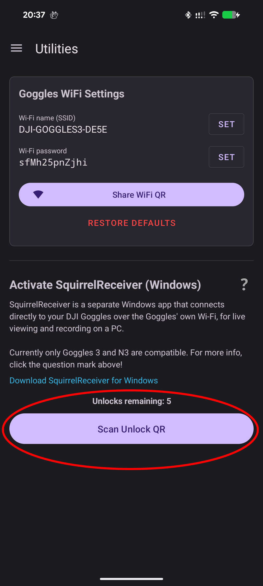

# Installing SquirrelReceiver Lite

SquirrelReceiver Lite is the Wi-Fi-only version of SquirrelReceiver.

It receives live video from DJI Goggles 3 over the goggles' Wi-Fi sharing mode and can record the received stream on the Windows PC. It is free to download for SquirrelCast owners.

If you want additional features such as wired USB live view, goggles charging while connected, lens correction, LUTs, detached video output, or a custom waiting screen logo, consider [SquirrelReceiver Pro](installing-squirrelreceiver-pro.md).

## Install

1. Download the latest SquirrelReceiver Lite release.
2. Extract the ZIP file if the release is packaged as a ZIP.
3. Start `SquirrelReceiver.exe`.
4. If Windows SmartScreen appears, confirm that you want to run the app.

Lite is not installed through the Microsoft Store. The Pro version is the Microsoft Store version.

## Unlock Lite with SquirrelCast

Lite uses the SquirrelCast Android app for unlocking.

1. Open SquirrelReceiver Lite on the Windows PC.
2. Open **Settings** in SquirrelReceiver.
3. Show the unlock QR code.
4. Open SquirrelCast on your Android phone.
5. Go to the **Utilities** tab.
6. Tap **Unlock** or **Scan Unlock QR**.
7. Scan the QR code shown by SquirrelReceiver.
8. Enter the generated license key into SquirrelReceiver.

SquirrelReceiver Lite runs in demo mode until it is unlocked. Demo mode is only there so you can confirm that the app starts and reaches the receiver screen before activating it.

> **Note:** The Lite unlock is tied to the Windows PC. If you change hardware or move to a different PC, the old key may not unlock the new machine.

## After unlocking

Continue with [Wi-Fi Liveview Setup](wifi-liveview-setup.md).

You will use SquirrelCast once more to configure the goggles' Wi-Fi name and password. After that, SquirrelReceiver receives the video directly from the goggles. SquirrelCast does not need to keep running while you use SquirrelReceiver.
