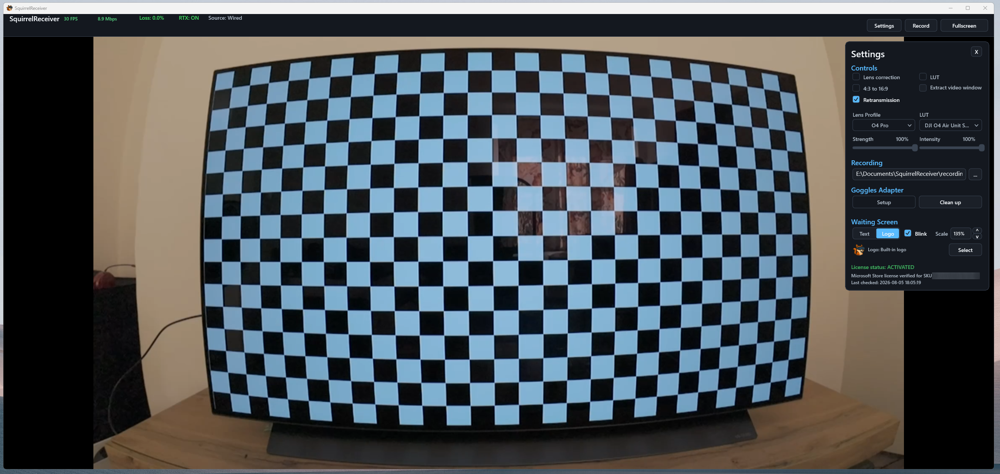
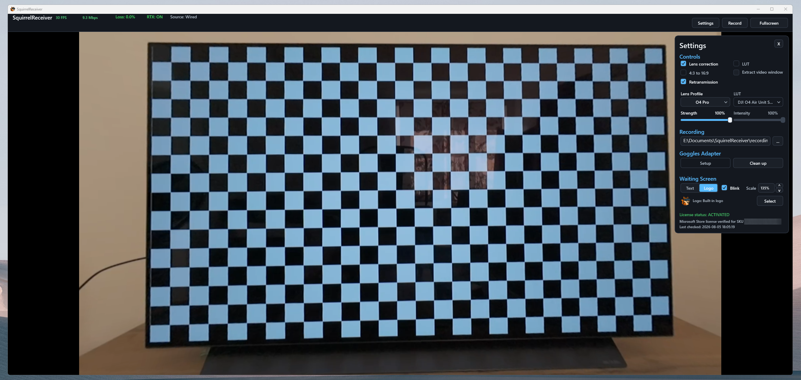
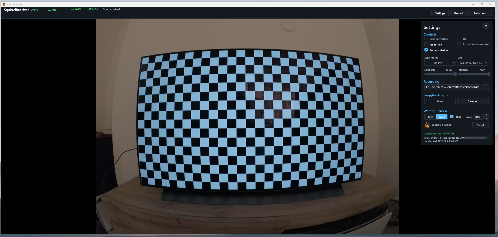
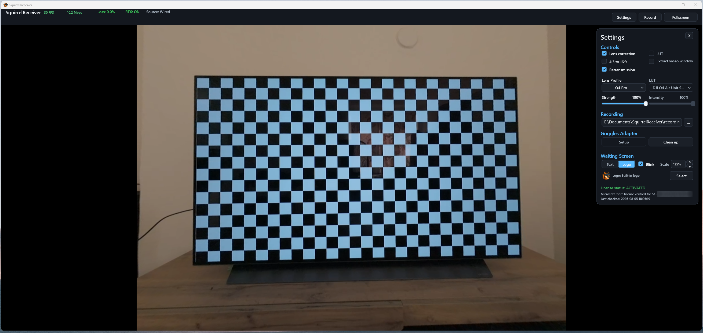
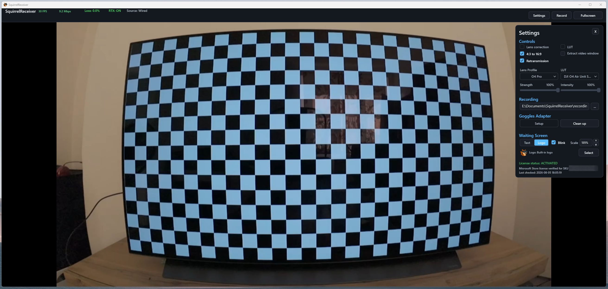
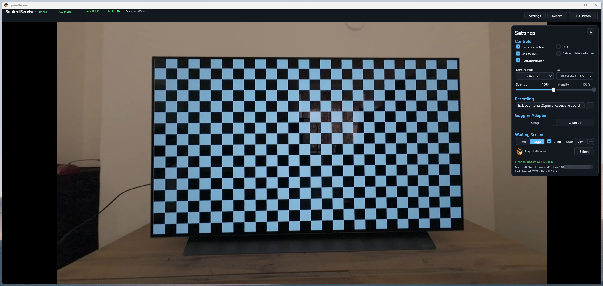
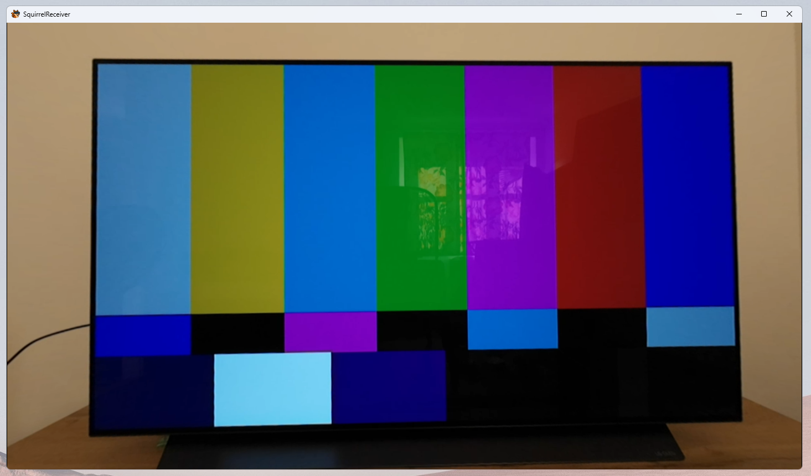
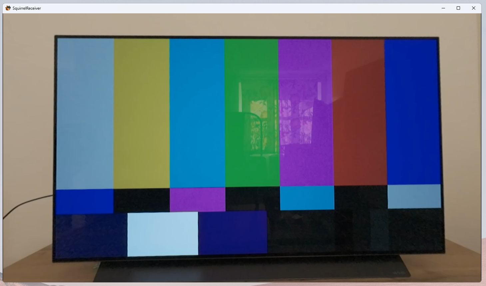
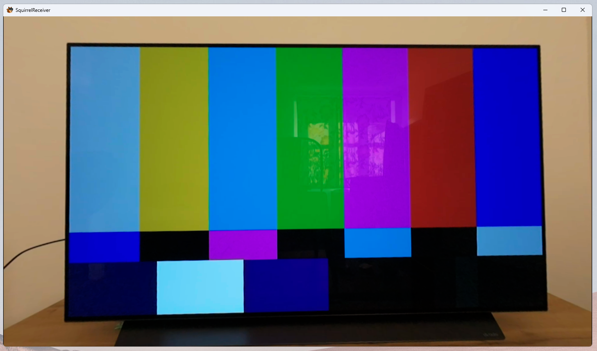
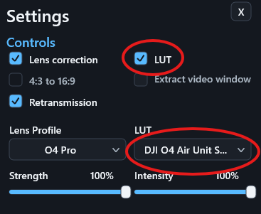

# Lens Correction and LUTs (Pro)

Lens correction and LUTs are SquirrelReceiver Pro features. Lens correction changes geometry; LUTs change color and tone.

## Lens correction

Lens correction reduces the wide-angle distortion from the DJI camera feed. The anti-distortion model is the same kind used by programs such as Gyroflow, and produces undistorted live video without the fisheye effect. This is useful when the receiver output is shown on a large monitor, streamed, or recorded for later use.

SquirrelReceiver Pro can use built-in lens profiles and supported custom profiles. Pick the profile that matches the camera, aspect ratio, and resolution you are using.

Use the **Strength** control to adjust how strongly the selected lens profile is applied.

Current built-in profiles are:

- **O3** — DJI O3 Air Unit
- **O4 Lite** — used by aircraft such as DJI Neo 2
- **O4 Pro** — used by aircraft such as DJI Avata 2
- **O4 Lite Wide** — planned, not available yet

### 16:9 comparison

| Uncorrected | Corrected |
| --- | --- |
|  |  |

Because of the remapping geometry, areas near the image edges appear stretched and larger than in reality. Some corner detail is also lost.

### 4:3 comparison

| Uncorrected | Corrected |
| --- | --- |
|  |  |

## 4:3 to 16:9 crop

Some camera modes use a 4:3 image. The 4:3-to-16:9 crop mode fills a 16:9 output while retaining the center of the source image.

This changes the field of view, so it is worth comparing the result with and without the crop before using it for an important stream or recording.

| 4:3 cropped to 16:9 | 4:3 cropped to 16:9 and corrected |
| --- | --- |
|  |  |

To retain the maximum image information in a corrected 16:9 livestream, the best option is generally a 4:3 source with both lens correction and the 4:3-to-16:9 crop enabled. The extra vertical image area gives the correction model more room, so less of the original view is cropped away.

## LUTs

LUTs are used for color conversion and monitoring. D-Log M looks flat and desaturated because it is intended for color grading. Applying the matching LUT gives the live view more natural contrast and color.

The following examples show the progression from the normal camera color to ungraded D-Log M and then D-Log M with the matching LUT applied.

### 1. Normal color mode

### 2. D-Log M without a LUT

### 3. D-Log M with the LUT enabled

For O4 Pro / O4 Air Unit D-Log M footage, use DJI's official LUT:

[DJI O4 Air Unit Series D-Log M to Rec.709](https://www.dji.com/downloads/softwares/o4-air-unit-dlog-to-rec709)

Use the LUT selector in SquirrelReceiver Pro settings to choose the LUT file, then use **Intensity** to control how strongly it is applied.

The wired Pro path is the best match for lens correction and LUTs because it gives the cleanest input stream before the image is processed.
