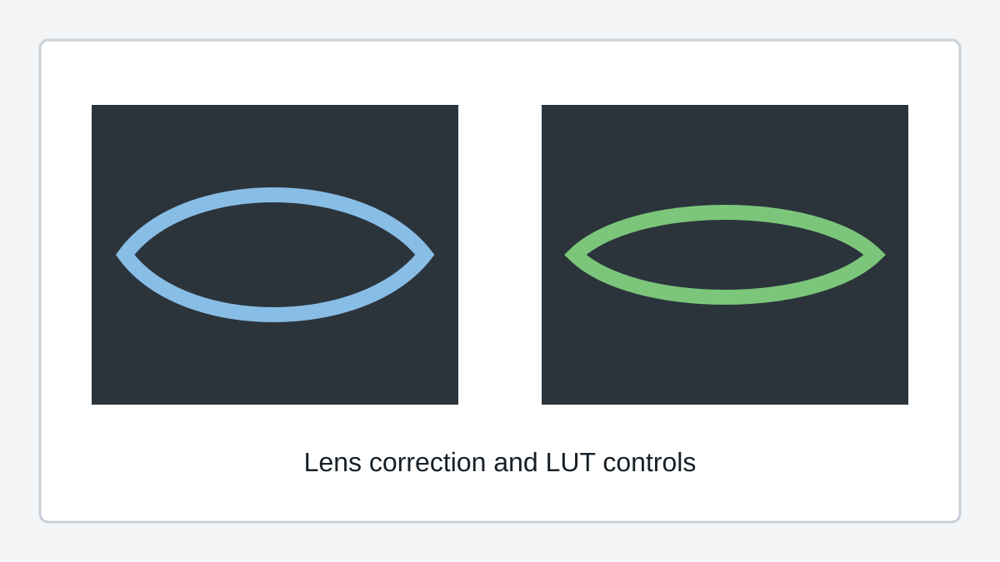

# Lens Correction and LUTs (Pro)

Lens correction and LUTs are SquirrelReceiver Pro features.

## Lens correction

Lens correction reduces the wide-angle distortion from the DJI camera feed. This is useful when the receiver output is shown on a large monitor, streamed, or recorded for later use.

SquirrelReceiver Pro can use built-in lens profiles and supported custom profiles. Pick the profile that matches the camera, aspect ratio, and resolution you are using.

## 4:3 to 16:9 expansion

Some camera modes use a 4:3 image. The 4:3 to 16:9 expansion mode fills a 16:9 output more naturally.

This changes the field of view and crop, so it is worth comparing the result with and without expansion before using it for an important stream or recording.

## LUTs

LUTs are used for color conversion and monitoring. A common use is converting DJI D-Log M toward Rec.709 so the live view looks more natural on a normal display.

For O4 Pro / O4 Air Unit D-Log M footage, use DJI's official LUT:

[DJI O4 Air Unit Series D-Log M to Rec.709](https://www.dji.com/downloads/softwares/o4-air-unit-dlog-to-rec709)

Use the LUT controls in SquirrelReceiver Pro settings to select the LUT file. The wired Pro path is the best match for lens correction and LUTs because it gives the cleanest input stream before the image is processed.
