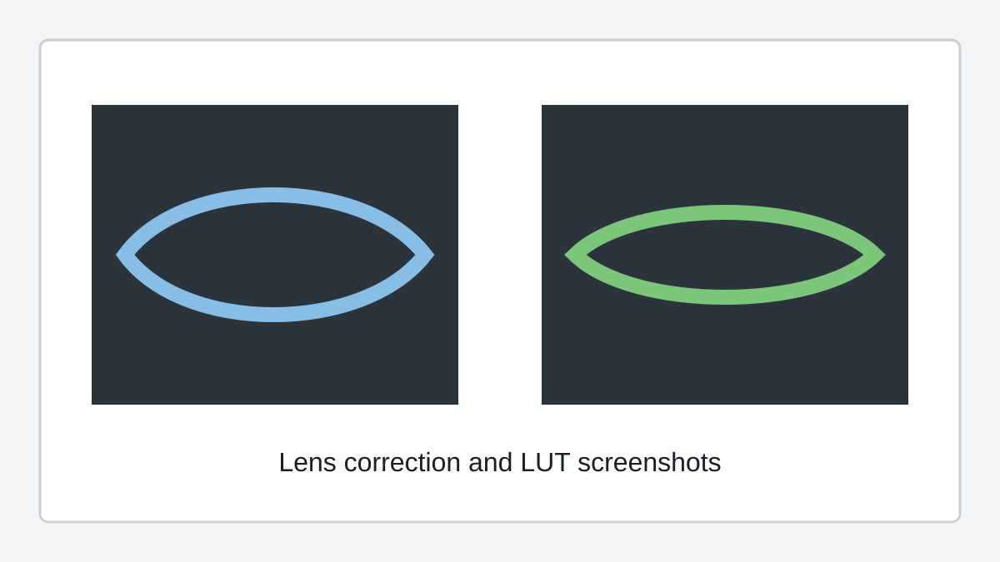

# Lens Correction and LUTs (Pro)

Lens correction and LUTs are SquirrelReceiver Pro features.

They are not included in SquirrelReceiver Lite.

<!-- TODO: Add final settings screenshots, FOV comparison images, and 4:3 to 16:9 examples. -->

## Lens correction

Lens correction can reduce the wide-angle distortion from the DJI camera feed.

The Pro version can include built-in profiles and can also load supported custom lens profiles. The receiver should choose profiles that match the stream aspect ratio and resolution.

## 4:3 to 16:9 expansion

Some goggles/camera modes use a 4:3 source image. Pro can include a 4:3 to 16:9 expansion mode so the output fills a 16:9 screen more naturally.

This needs visual examples before release, because users should be able to see the FOV tradeoff clearly.

## LUTs

LUT support is for color conversion and grading workflows, for example converting D-Log M footage toward Rec.709 for easier monitoring.

The exact LUT file location and supported file types will be documented here before release.

## Notes

- These features can affect performance.
- Use the wired Pro path if you want the cleanest preview while also applying correction or LUTs.
- Lite should not show these controls.
