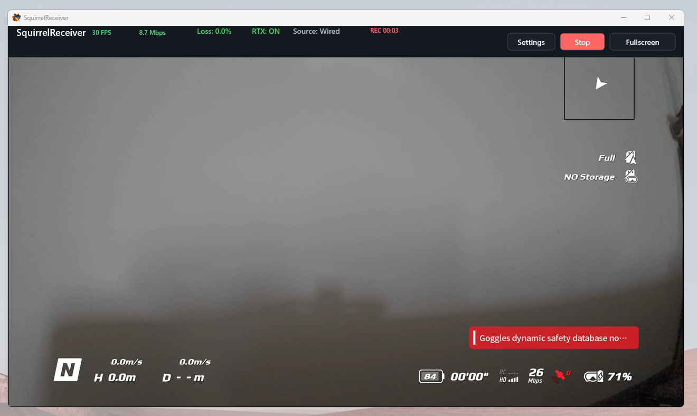

# Recording Video

SquirrelReceiver can record the live video stream to the Windows PC.

## Start and stop recording

Use the **Record** button in SquirrelReceiver to start recording. While recording, the button changes to **Stop** and the status bar displays the recording duration. Select **Stop** to finish and save the recording.

Recording is available after the receiver is unlocked/licensed:

- Lite: after SquirrelCast unlock
- Pro: after Microsoft Store license is active

If the app is still in unactivated Lite demo mode, recording may be disabled.

## Save location

By default, recordings are saved in the SquirrelReceiver recordings folder under your Windows Documents folder.

You can change the recording path in SquirrelReceiver settings.

> **Note:** Use a local folder on a fast drive when possible. Network folders, cloud-synced folders, and slow USB drives can cause dropped frames or failed writes.

## Camera View Recording

Do not confuse SquirrelReceiver recording with the goggles' **Camera View Recording** setting.

The goggles setting changes what video signal the goggles share. SquirrelReceiver recording saves whatever live view stream SquirrelReceiver is receiving.

If SquirrelReceiver is not receiving video while testing without a connected air unit or drone, enable Camera View Recording in the goggles or connect a video source.

## If recording does not start

Check:

- The receiver is unlocked/licensed.
- Live video is actually arriving.
- The recording folder exists and is writable.
- The disk is not full.
- Antivirus or controlled folder access is not blocking writes.

If recording starts but the file is not useful, try a shorter recording and check whether the live view itself was stable during the same time.
