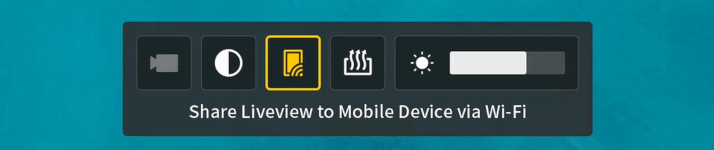

# Troubleshooting

Most connection problems come from one of three things: Liveview sharing is off, Windows is connected to the wrong Wi-Fi network, or USB-C negotiated the wrong role.

## FAQ

### Why is there no video in Wi-Fi mode?

Check that DJI Goggles 3 are powered on and **Liveview sharing** is enabled in the goggles.

Then check Windows:

- The PC is connected to the goggles' Wi-Fi network.
- Windows did not switch back to your home Wi-Fi.
- Windows Firewall allowed SquirrelReceiver on private networks.

If you are testing without an air unit or drone, enable **Camera View Recording** in the goggles or connect a real video source.

See [Wi-Fi Liveview Setup](wifi-liveview-setup.md).

### Why is there no video in wired mode?

Check that you are using SquirrelReceiver Pro. Wired USB mode is Pro only.

Then check:

- Liveview sharing is enabled in the goggles.
- The goggles are connected by USB-C.
- The goggles are charging or otherwise visibly connected.
- Windows shows the goggles adapter.
- The adapter IP is set to `192.168.60.1` with subnet `255.255.255.0` or prefix `24`.

If this is the first time using this PC/goggles combination, follow [First-Time USB Adapter Setup (Pro)](usb-wired-first-time-adapter-setup-pro.md).

If the adapter does not appear, unplug and replug the cable, flip the USB-C plug, try another port, or use **Settings > About > OTG Wired Connection to Computer** in the goggles.

See [USB Wired Setup (Pro)](usb-wired-setup-pro.md).

### Where is the Liveview sharing setting?

Enable **Share Liveview to Mobile Device via Wi-Fi** in the goggles.

  

This setting is required for both Wi-Fi and wired mode. If it is off, SquirrelReceiver can be installed, licensed, connected, and still show no video.

### Why does bench testing show no signal?

If no air unit or drone is connected, the goggles may not output a useful signal.

Try one of these:

- Connect an air unit or drone so the goggles receive real video.
- Enable **Camera View Recording** in the goggles and test again.

### Why does Wi-Fi video glitch or stutter?

Wi-Fi mode can show artifacts or stutter when packets are lost.

Things that can help:

- Keep the PC close to the goggles.
- Avoid crowded Wi-Fi environments.
- Make sure Windows stays connected to the goggles' Wi-Fi.
- Stop downloads or other heavy network traffic on the PC.

For the cleanest path, use wired mode in SquirrelReceiver Pro.

### Why does wired mode charge slowly?

USB-A to USB-C cables can work, but often charge slowly.

For the best result, use a USB-C port on the PC and a USB-C to USB-C cable. If that connects in the wrong role, follow the cable negotiation steps in [USB Wired Setup (Pro)](usb-wired-setup-pro.md).

### Why does Lite not unlock?

Check:

- SquirrelCast is installed on the Android phone.
- You are scanning the QR code shown by SquirrelReceiver Lite.
- The generated key is entered exactly as shown.
- You are unlocking the same Windows PC that generated the QR code.

Lite activation is hardware-tied. Hardware changes can require a new unlock.

### Why does Pro show as not licensed?

Check:

- You are signed into the Microsoft Store with the account that bought Pro.
- SquirrelReceiver Pro was installed from the Store.
- Store updates are installed.
- Windows has been restarted if the license status seems stale.

Pro does not use the SquirrelCast QR unlock flow.

### Why does recording not start?

Check:

- The app is unlocked/licensed.
- Live video is arriving.
- The recording folder exists.
- The disk has enough free space.
- Windows security settings are not blocking writes.

See [Recording Video](recording-video.md).
