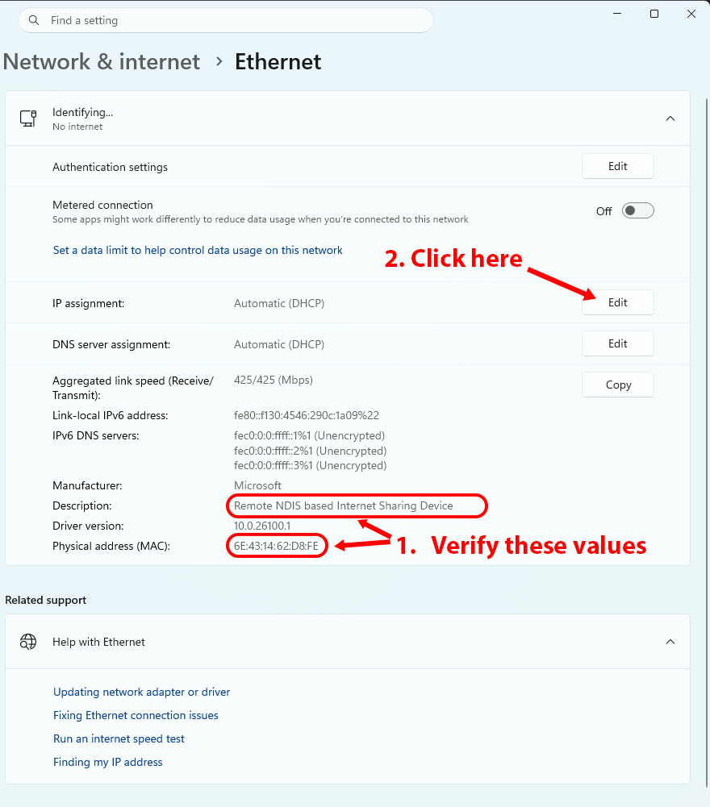
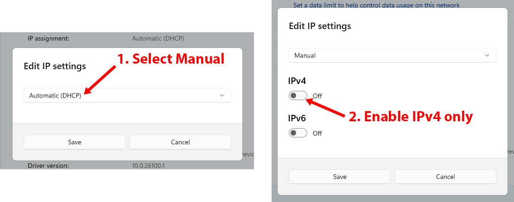
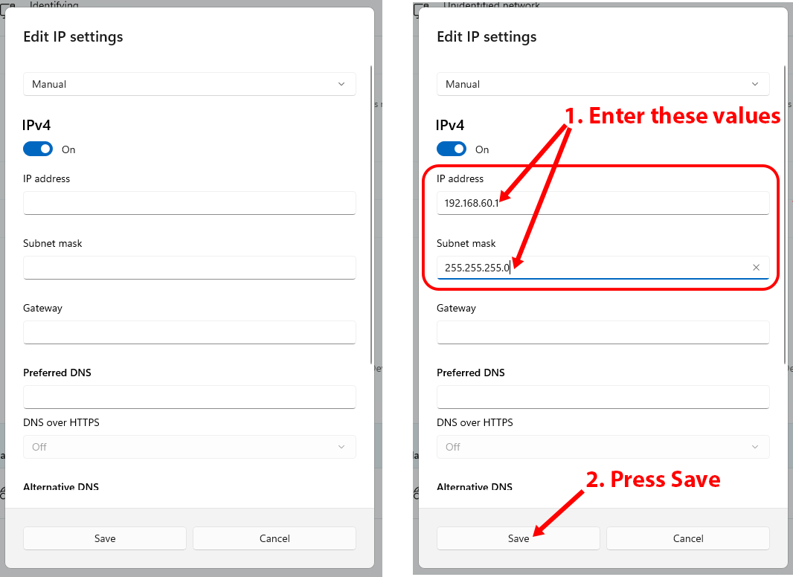
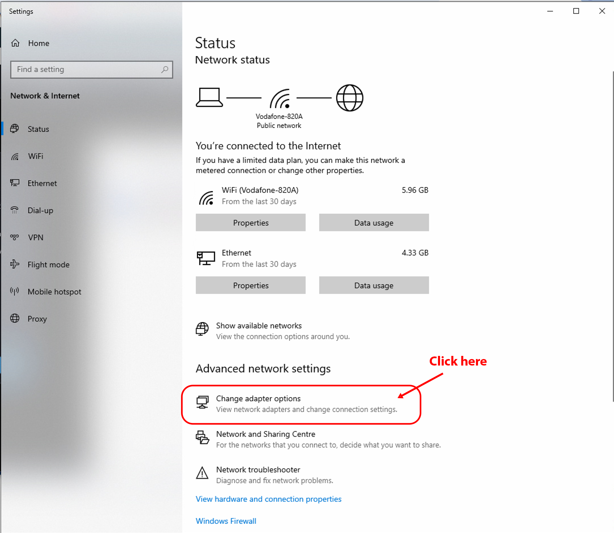
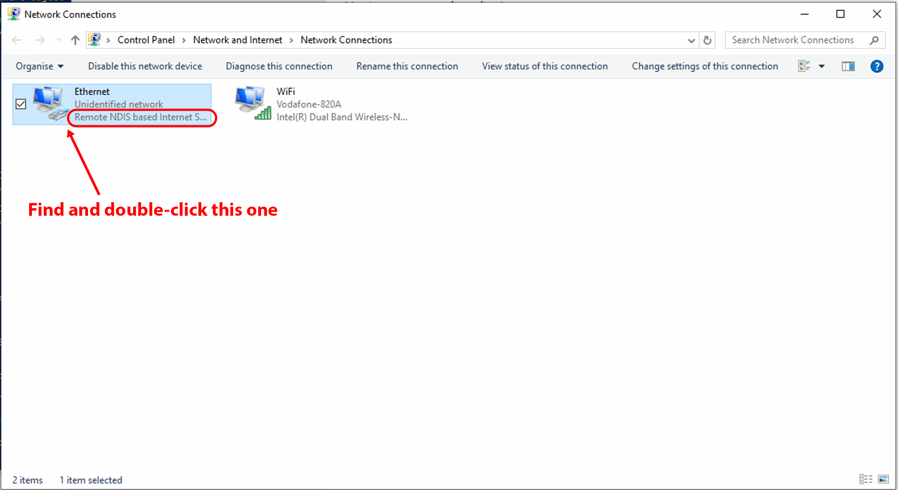
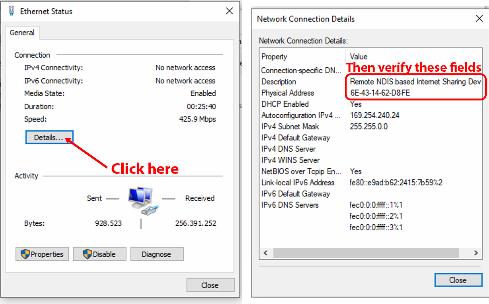
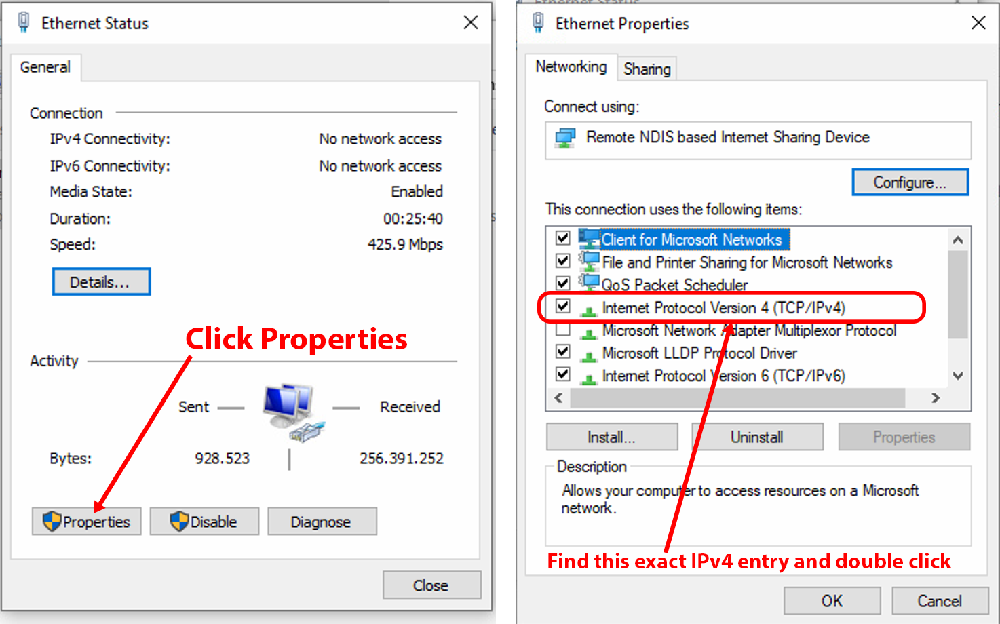
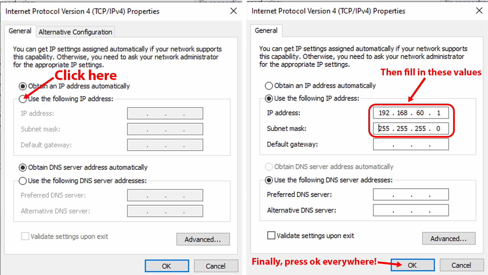
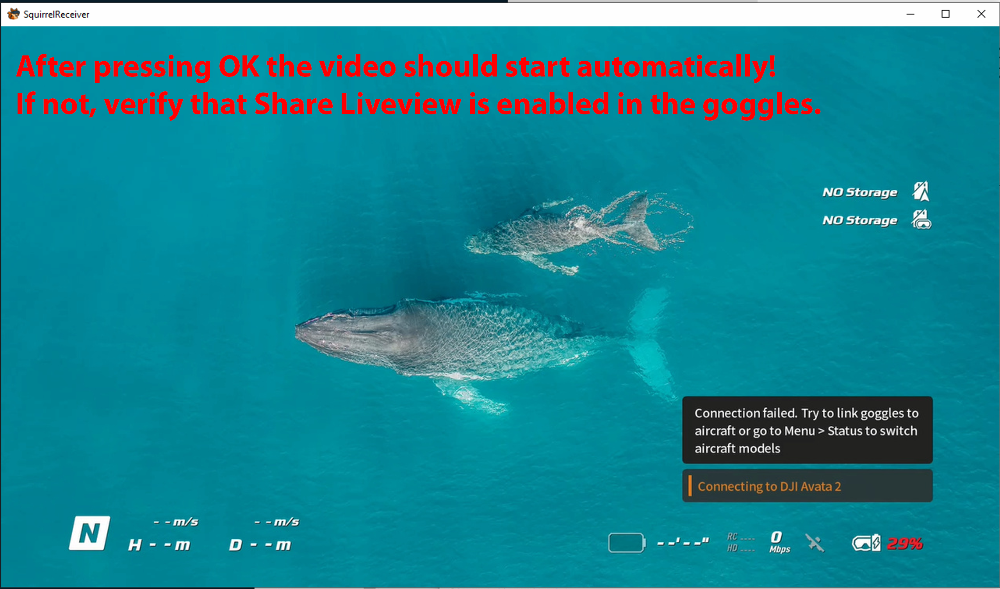

# USB Wired Setup (Pro)

Wired USB mode is a SquirrelReceiver Pro feature.

It receives the DJI Goggles 3 live view over USB instead of Wi-Fi. This usually gives much cleaner video and lower latency, and it charges the goggles while connected.

Expected latency is usually around **100-150 ms**. The best cases can be around **75 ms**.

> **Important:** Liveview sharing still needs to be enabled in the goggles. Wired mode does not replace that goggles setting.

## Cable setup

The most reliable setup is:

- A USB-C port on the PC
- A USB-C to USB-C cable
- The goggles connected directly to the PC

Normal USB-A to USB-C cables can also work, but they usually charge the goggles more slowly.

OTG adapters can work, but put the OTG adapter on the **PC side**, not on the goggles side.

## If USB-C connects the wrong way

Sometimes USB-C negotiation picks the wrong role. The goggles may think they are the USB host, while the PC treats the goggles like a charger.

If SquirrelReceiver does not see the goggles:

1. Unplug the cable.
2. Replug it.
3. Flip the USB-C plug around.
4. Try another USB-C port if the PC has one.
5. Repeat a few times if needed.

If that still does not work, use the goggles menu:

1. In the goggles, open **Settings**.
2. Go to **About**.
3. Select **OTG Wired Connection to Computer**.
4. Wait until the goggles show that they are connected.
5. Exit the screen and return to live view.

This can leave a small OTG wired mode label in the bottom right of the goggles view. It does not hurt the connection, but it can be annoying. You can usually turn it off from **Status** in the goggles menu. If the connection drops after turning it off, enable the wired mode screen again.

The behavior can be a little random between cables, USB ports, and PCs. Try the normal plug/replug path and the goggles OTG menu path if one of them does not work cleanly.

## Windows adapter setup

SquirrelReceiver Pro from the Microsoft Store cannot change Windows network adapter settings automatically. If Windows does not already have the right IP settings, set them manually.

Use:

- IP address: `192.168.60.1`
- Subnet mask: `255.255.255.0`
- Prefix length, if Windows asks for that instead: `24`
- Gateway: leave blank
- DNS: leave blank or automatic

The goggles adapter usually appears as **Remote NDIS based Internet Sharing Device**.

## Windows 11

1. Connect the goggles to the PC by USB and leave them connected.
2. In SquirrelReceiver, open **Settings** and click **Setup** under Goggles Adapter.
3. Note the Windows network name, adapter description, and MAC address.
4. Click **Settings**. Windows opens the Ethernet settings page.

If the button does not open this page, open Windows Settings, choose **Network & internet**, then open **Ethernet**.

### 1. Verify the goggles adapter

Windows may show the goggles as **Unidentified network**, **Identifying...**, or another network name. Use the description and MAC address shown by SquirrelReceiver to verify the correct adapter before changing anything.

Confirm that **Description** is **Remote NDIS based Internet Sharing Device** and that **Physical address (MAC)** matches the MAC address shown by SquirrelReceiver. Then click **Edit** next to **IP assignment**.

### 2. Choose manual IPv4

In Edit IP settings, change **Automatic (DHCP)** to **Manual**, then enable **IPv4**. Leave IPv6 off for this adapter setup.

### 3. Enter the IP address

Enter IP address `192.168.60.1` and subnet mask `255.255.255.0`. Leave gateway and DNS fields blank, then click **Save**.

Some Windows 11 builds show **Subnet prefix length** instead of **Subnet mask**. If so, enter `24`.

## Windows 10

1. Connect the goggles to the PC by USB and leave them connected.
2. In SquirrelReceiver, open **Settings** and click **Setup** under Goggles Adapter.
3. Note the adapter name, description, and MAC address.
4. Click **Settings**. Windows opens Network & Internet settings.

If the button does not open this page, open Windows Settings, choose **Network & Internet**, then open **Status**.

### 1. Open Network Connections

On the Status page, scroll down to Advanced network settings and click **Change adapter options**.

### 2. Pick the goggles adapter

Find the adapter with the name shown in SquirrelReceiver, such as **Ethernet**, and check that the line below it says **Remote NDIS based Internet Sharing Device**.

If you are unsure, keep this Network Connections window open, unplug the goggles, and watch which adapter disappears. Plug the goggles back in and use the adapter that returns.

### 3. Verify the adapter details

Double-click the adapter to open its Status window. Click **Details**, then compare **Description** and **Physical Address** with the values shown by SquirrelReceiver. When they match, close the Details window.

### 4. Open IPv4 settings

In the Status window, click **Properties**. If Windows asks for administrator approval, approve it. In Ethernet Properties, find **Internet Protocol Version 4 (TCP/IPv4)** and double-click it.

### 5. Enter the IP address

Choose **Use the following IP address**. Enter IP address `192.168.60.1` and subnet mask `255.255.255.0`. Leave default gateway blank and leave DNS on automatic. Click **OK** in each open settings window.

## Return to SquirrelReceiver

After Windows accepts the IPv4 settings, SquirrelReceiver should detect the configured adapter and start the wired video path automatically.

If video does not start:

- Confirm that Liveview sharing is enabled in the goggles.
- Confirm that the goggles are still connected by USB.
- Try the cable negotiation steps above.
- Make sure you changed the correct Windows adapter.

## Restore automatic IP

Use this if you want Windows to go back to automatic addressing for the goggles adapter.

1. Connect the goggles to the PC by USB.
2. In SquirrelReceiver, open **Settings** and click **Clean up** under Goggles Adapter.
3. Open the same Windows adapter settings.
4. Confirm the adapter description and MAC address if needed.
5. Change IPv4 back to automatic/DHCP.
6. Save and return to SquirrelReceiver.

The adapter name can vary by machine. The adapter description and MAC address are the reliable checks.
