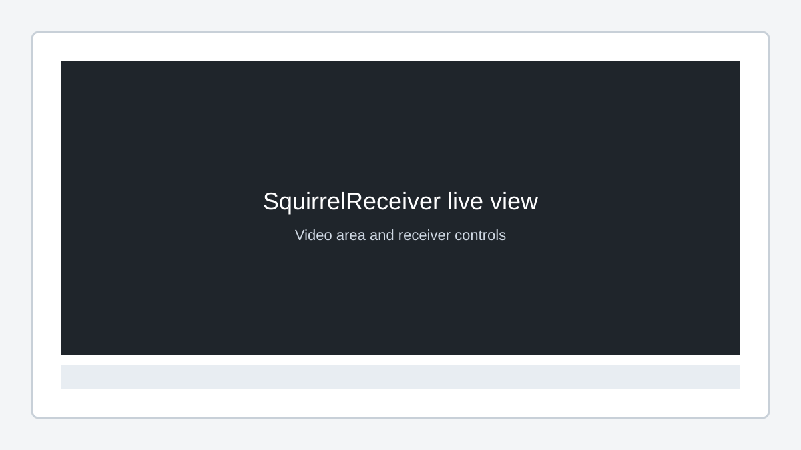
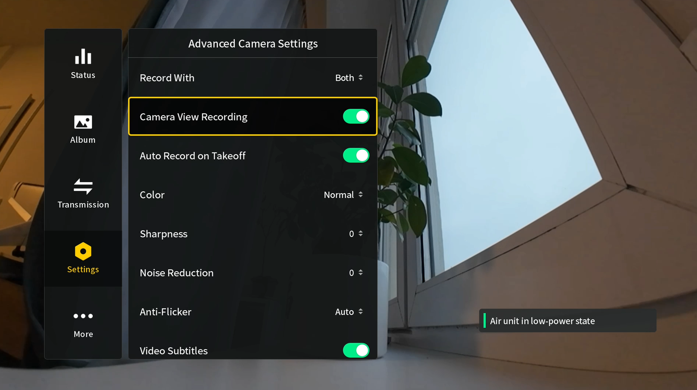

# Using Live View

After setup, SquirrelReceiver waits for the DJI Goggles 3 live view stream and shows it in the main window.

## Start receiving video

For both Wi-Fi and wired mode, check these first:

1. The goggles are powered on.
2. **Liveview sharing** is enabled in the goggles.
3. The PC is connected to the goggles by the selected path:
   - Wi-Fi for Lite or Pro Wi-Fi mode
   - USB-C for Pro wired mode
4. The goggles have an active video source, or Camera View Recording is enabled for testing.

If one of these is missing, SquirrelReceiver can open normally but stay on the waiting screen.

## Camera View Recording and clean video

The goggles' **Camera View Recording** setting affects what the goggles output when there is no active air unit/drone video and how clean the shared feed is.

If nothing is connected to the goggles, they may output no signal at all unless Camera View Recording is enabled. If you are testing on the bench and SquirrelReceiver appears to do nothing, either connect an air unit/drone or turn on Camera View Recording and try again.

For normal flying video, turn Camera View Recording off if you want the cleaner camera feed without the goggles UI in the shared stream.

## Fullscreen

Use fullscreen when the receiver is feeding a monitor, laptop, or capture workflow.

In Pro, the detached video window can also be fullscreen on another display. See [Detached Video Window (Pro)](detached-video-window-pro.md).

## Demo mode

Demo mode only matters for unactivated Lite.

If Lite is not unlocked yet, paid features are limited and the app is meant only for checking that it starts and reaches the receiver view. Unlock Lite with SquirrelCast before using it normally.

Pro uses Microsoft Store licensing instead of Lite demo activation.

## Common things to check

- Liveview sharing is enabled.
- Windows Firewall is not blocking SquirrelReceiver.
- For Wi-Fi mode, Windows is still connected to the goggles' Wi-Fi.
- For wired mode, the goggles are connected in the correct USB role.
- If testing without a drone or air unit, try Camera View Recording.
