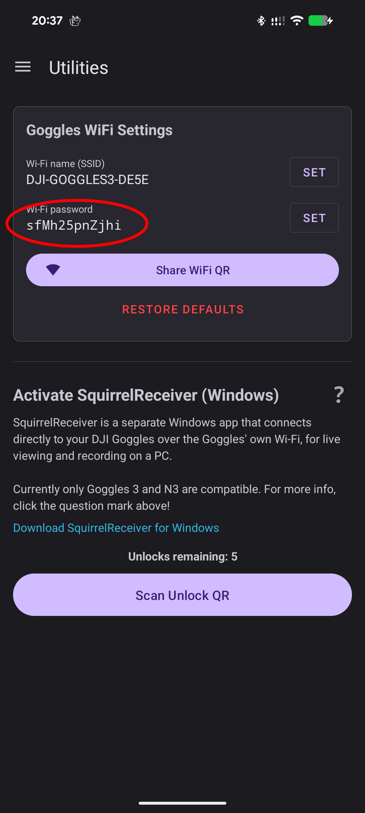
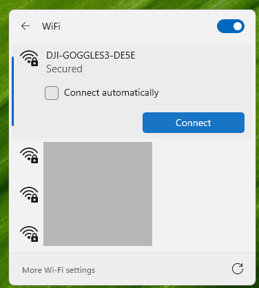

# Wi-Fi Liveview Setup

Wi-Fi live view works in SquirrelReceiver Lite and SquirrelReceiver Pro.

The PC connects to the Wi-Fi network created by DJI Goggles 3. SquirrelReceiver then receives the live view directly from the goggles.

## What you need

- DJI Goggles 3
- Windows 10 or Windows 11 PC
- SquirrelCast on Android
- SquirrelReceiver Lite or Pro

SquirrelCast is used to configure the goggles' Wi-Fi name and password. It does not need to keep running after the goggles are configured.

## Configure the goggles' Wi-Fi

1. Connect your Android phone to the goggles with USB-C.
2. Open SquirrelCast.
3. Open the **Utilities** tab.
4. Open the goggles Wi-Fi settings.
5. Set the SSID and password you want to use, or note the existing values.
6. Apply the settings to the goggles.

## Enable Liveview sharing

On the goggles, enable **Share Liveview to Mobile Device via Wi-Fi**.

This step is required. If Liveview sharing is off, SquirrelReceiver will wait but no video will arrive.

  

## Connect Windows to the goggles' Wi-Fi

1. On the Windows PC, open Wi-Fi settings.
2. Connect to the SSID configured in SquirrelCast.
3. Start SquirrelReceiver.
4. Allow the Windows Firewall prompt if it appears.

  
  

> **Note:** Windows may reconnect to your home Wi-Fi if it thinks the goggles' Wi-Fi has no internet. If video stops, check that the PC is still connected to the goggles.

## If there is still no video

Check these first:

- Liveview sharing is enabled in the goggles.
- The PC is connected to the goggles' Wi-Fi, not your home Wi-Fi.
- Windows Firewall allowed SquirrelReceiver on private networks.
- The goggles have an active video source, or Camera View Recording is enabled for bench testing.

If no air unit or drone is connected, the goggles may not output a useful live view signal. Turn on **Camera View Recording** in the goggles or connect an air unit to confirm that the receiver path works.

Wi-Fi quality matters. Interference, distance, and Windows roaming behavior can all cause glitches. If you want the cleanest and lowest-latency path, use [USB Wired Setup (Pro)](usb-wired-setup-pro.md).
